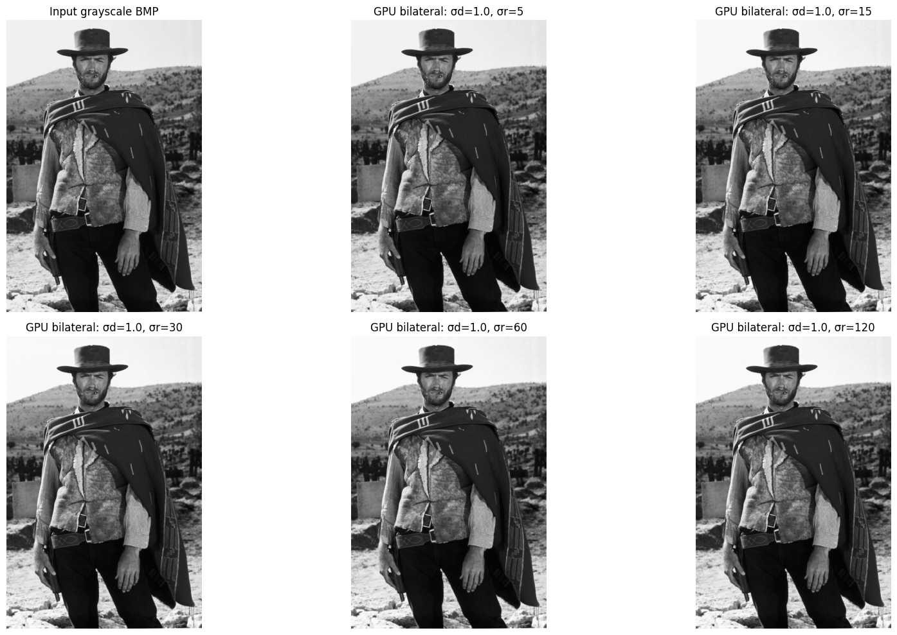
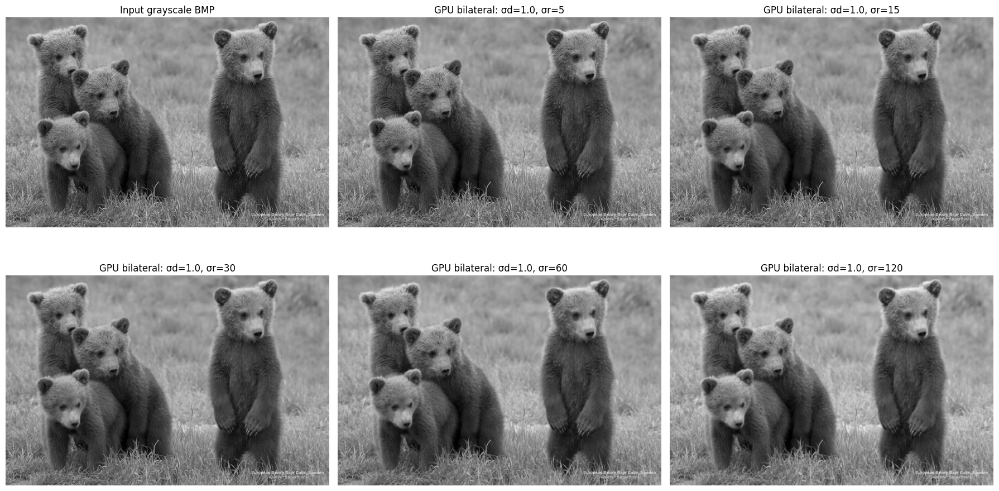

# Лабораторная работа (Bilateral filtering on GPU)

## Описание работы

В лабораторной работе реализован 9-точечный bilateral filter для grayscale BMP-изображений с использованием CUDA.  
Дополнительно реализована последовательная CPU-версия, которая используется как эталон для проверки корректности результата GPU.

Bilateral filter сглаживает изображение, но при этом сохраняет границы объектов. Для каждого пикселя вычисляется новое значение как взвешенная сумма значений из окна `3×3`. Вес каждого соседнего пикселя зависит от двух факторов:

1. **Пространственная близость** к центральному пикселю, задаваемая параметром $\sigma_d$.
2. **Сходство яркости** с центральным пикселем, задаваемое параметром `$\sigma_r$`.

Итоговый вес соседнего пикселя вычисляется как произведение пространственного веса и веса по яркости:

$$
w = w_d \cdot w_r
$$

Пространственный вес:

$$
w_d = \exp\left(-\frac{dx^2 + dy^2}{2\sigma_d^2}\right)
$$

Вес по яркости:

$$
w_r = \exp\left(-\frac{(I_{neighbor} - I_{center})^2}{2\sigma_r^2}\right)
$$

Итоговое значение центрального пикселя после фильтрации:

$$
I'_{center} =
\frac{
\sum\limits_{dy=-1}^{1} \sum\limits_{dx=-1}^{1}
I(x + dx, y + dy) \cdot w_d(dx, dy) \cdot w_r(dx, dy)
}{
\sum\limits_{dy=-1}^{1} \sum\limits_{dx=-1}^{1}
w_d(dx, dy) \cdot w_r(dx, dy)
}
$$

где:

- $dx$, $dy$ — смещение соседнего пикселя относительно центрального пикселя;
- $I_{neighbor}$ — яркость соседнего пикселя;
- $I_{center}$ — яркость центрального пикселя;
- $\sigma_d$ — параметр пространственного гауссова веса;
- $\sigma_r$ — параметр веса по разности яркости.

## Ссылка на Google Colab

Ноутбук с полной реализацией и всеми ячейками для компиляции доступен по ссылке:

[Открыть notebook в Google Colab](https://colab.research.google.com/drive/1RrYU4tqYXA2t51s5dMa6dyUN53YXAS7M?usp=sharing)


## Реализация

Программа состоит из следующих основных частей:

- чтение входного BMP-изображения;
- приведение изображения к 8-bit grayscale;
- последовательная CPU-реализация bilateral filter;
- CUDA-реализация bilateral filter;
- запись результатов в BMP-файлы;
- измерение времени CPU и GPU;
- сравнение CPU- и GPU-результатов.

В CUDA-версии используется `cudaTextureObject_t`. Входное изображение копируется в `cudaArray`, после чего создаётся texture object. Внутри CUDA-ядра центральный пиксель и его соседи читаются через `tex2D`.

Границы изображения обрабатываются по правилу ближайшего пикселя: если координаты соседа выходят за пределы изображения, они заменяются на ближайшие допустимые координаты.

## Что было распараллелено и почему

Был распараллелен расчёт новых значений пикселей изображения.

Каждый выходной пиксель вычисляется независимо от остальных: для пикселя `(x, y)` требуется только значение центрального пикселя и значения его соседей из окна `3×3` во входном изображении. Результат записывается в отдельную ячейку выходного массива. Поэтому между потоками CUDA нет зависимостей по данным, и задача хорошо подходит для параллельного выполнения на GPU.

В CUDA-реализации один поток обрабатывает один пиксель:

```text
1 CUDA thread -> 1 output pixel
```

Сетка потоков имеет двумерную структуру. Размер блока был выбран `16×16`, а размер сетки рассчитывается по размерам изображения.

## Параметры экспериментов

Эксперименты проводились на двух изображениях разных размеров:

- `image_1`: `1600×2400`, всего `3 840 000` пикселей;
- `image_2`: `736×477`, всего `351 072` пикселя.

Для каждого изображения были выполнены запуски при фиксированном:

```text
sigma_d = 1.0
```

и пяти значениях параметра `sigma_r`:

```text
sigma_r = 5, 15, 30, 60, 120
```

Для измерения GPU-времени использовалось:

```text
3 прогревочных запуска
20 измеряемых запусков
```

В таблице `GPU kernel avg` — среднее время выполнения CUDA-ядра по 20 запускам.  
`GPU estimated total` — оценка полного времени одного GPU-запуска с учётом подготовки texture memory, копирования данных на устройство, выполнения ядра и копирования результата обратно.

Ускорение считалось по формулам:

```text
kernel speedup = CPU time / GPU kernel avg

estimated total speedup = CPU time / GPU estimated total
```

## Результаты экспериментов

| image   |   width |   height |   pixels |   sigma_d |   sigma_r |   CPU time, ms |   GPU kernel avg, ms |   GPU estimated total, ms |   kernel speedup |   estimated total speedup |   max abs diff |   mean abs diff |
|:--------|--------:|---------:|---------:|----------:|----------:|---------------:|---------------------:|--------------------------:|-----------------:|--------------------------:|---------------:|----------------:|
| image_1 |    1600 |     2400 |  3840000 |         1 |         5 |       513.208  |             0.519722 |                   189.151 |          987.466 |                  2.71322  |              1 |           2e-06 |
| image_1 |    1600 |     2400 |  3840000 |         1 |        15 |       511.361  |             0.344342 |                   154.106 |         1485.04  |                  3.31824  |              1 |           1e-06 |
| image_1 |    1600 |     2400 |  3840000 |         1 |        30 |       770.928  |             0.49617  |                   165.956 |         1553.76  |                  4.64537  |              1 |           1e-06 |
| image_1 |    1600 |     2400 |  3840000 |         1 |        60 |       833.798  |             0.524845 |                   174.788 |         1588.66  |                  4.77036  |              1 |           1e-06 |
| image_1 |    1600 |     2400 |  3840000 |         1 |       120 |       511.517  |             0.452506 |                   168.281 |         1130.41  |                  3.03965  |              1 |           0     |
| image_2 |     736 |      477 |   351072 |         1 |         5 |        72.8169 |             0.056091 |                   181.111 |         1298.19  |                  0.402057 |              1 |           3e-06 |
| image_2 |     736 |      477 |   351072 |         1 |        15 |        72.2288 |             0.036403 |                   162.29  |         1984.14  |                  0.44506  |              1 |           3e-06 |
| image_2 |     736 |      477 |   351072 |         1 |        30 |        71.1329 |             0.032443 |                   160.432 |         2192.55  |                  0.443384 |              0 |           0     |
| image_2 |     736 |      477 |   351072 |         1 |        60 |        72.5239 |             0.033221 |                   166.354 |         2183.08  |                  0.435962 |              0 |           0     |
| image_2 |     736 |      477 |   351072 |         1 |       120 |        45.0767 |             0.031333 |                   131.817 |         1438.63  |                  0.341965 |              1 |           3e-06 |

## Сводная таблица

| Изображение   | Размер    |   Пикселей |   Среднее CPU, ms |   Среднее GPU kernel, ms |   Среднее GPU total, ms |   Среднее ускорение kernel |   Среднее ускорение total |
|:--------------|:----------|-----------:|------------------:|-------------------------:|------------------------:|---------------------------:|--------------------------:|
| image_1       | 1600×2400 |    3840000 |           628.163 |                    0.468 |                 170.456 |                    1349.07 |                     3.697 |
| image_2       | 736×477   |     351072 |            66.756 |                    0.038 |                 160.401 |                    1819.32 |                     0.414 |


### Визуальные результаты лабораторной работы

На рисунках ниже показаны получившиеся в ходе лабораторной работы изображения с разными sigma_r.






## Анализ результатов

По результатам экспериментов CPU- и GPU-реализации дают практически одинаковые изображения. Максимальное абсолютное отклонение между CPU и GPU не превышает `1` уровня яркости, а средняя абсолютная ошибка находится около нуля. Это подтверждает корректность CUDA-реализации.

На большом изображении `image_1` CUDA-ядро выполняется значительно быстрее CPU. Ускорение только ядра находится примерно в диапазоне от `987×` до `1589×`. Даже с учётом накладных расходов на подготовку texture memory и копирование данных полное GPU-время меньше CPU-времени: ускорение полного процесса составляет примерно от `2.71×` до `4.77×`.

На меньшем изображении `image_2` CUDA-ядро также выполняется намного быстрее CPU: ускорение ядра находится примерно в диапазоне от `1298×` до `2193×`. Однако полное GPU-время оказывается больше CPU-времени, если учитывать выделение памяти, создание texture object и копирование данных. Поэтому `estimated total speedup` меньше `1`. Это объясняется тем, что для небольшого изображения накладные расходы GPU становятся больше, чем само время вычислений.

Визуально увеличение `sigma_r` приводит к более заметному сглаживанию. При малых значениях `sigma_r`, например `5` и `15`, фильтр сильнее сохраняет границы, потому что пиксели с сильно отличающейся яркостью получают малые веса. При больших значениях `sigma_r`, например `60` и `120`, range-компонента становится менее строгой, поэтому фильтр начинает вести себя ближе к обычному гауссовому сглаживанию.

## Вывод

В ходе лабораторной работы была реализована CUDA-версия 9-точечного bilateral filter с использованием texture memory. Расчёт был распараллелен по пикселям, так как значение каждого выходного пикселя зависит только от локального окна входного изображения и может вычисляться независимо.

Проведённые эксперименты показали, что CUDA-ядро обеспечивает существенное ускорение по сравнению с CPU. Для больших изображений ускорение сохраняется даже с учётом копирования данных и подготовки texture memory. Для малых изображений чистое время вычислений на GPU также значительно меньше CPU-времени, однако полное GPU-время может быть больше из-за накладных расходов.

Результаты CPU и GPU совпадают с точностью до одного уровня яркости, что подтверждает корректность реализации.
